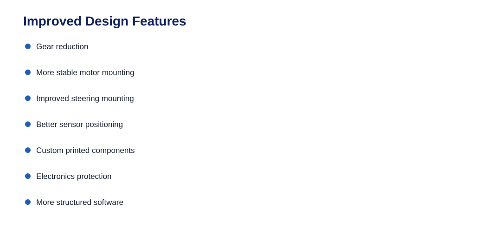
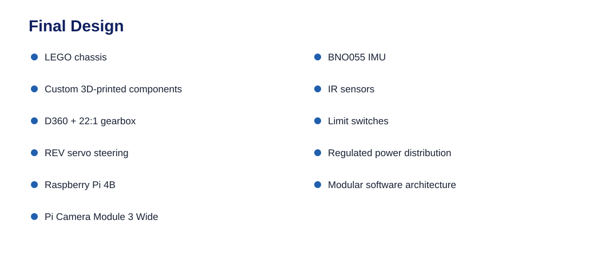
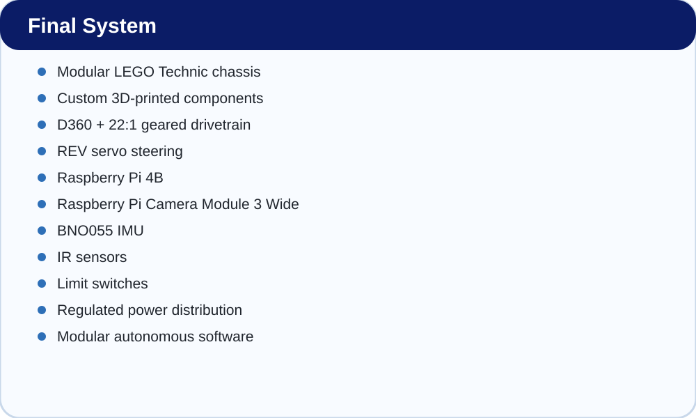

# Design Evolution

The robot was developed through repeated changes rather than as one
final design.

### Early Design

The initial objective was to create a vehicle capable of moving and
steering.

### Intermediate Design

Driving tests identified issues with:

### Improved Design

We introduced:

### Final Design

The final system combines:

------------------------------------------------------------------------
