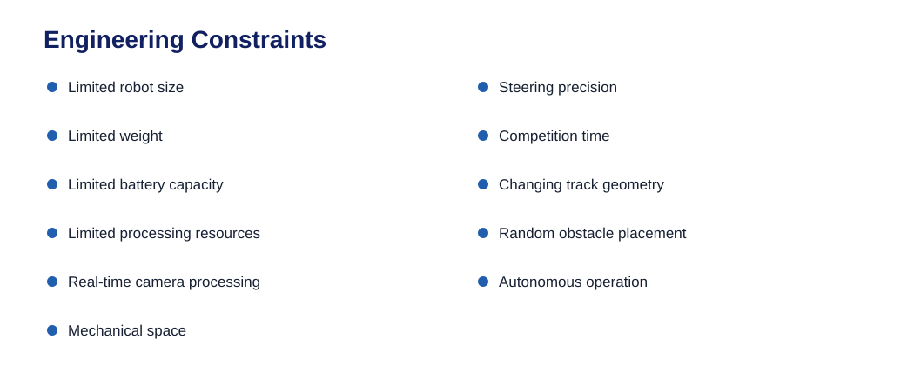

# Engineering Constraints

The major constraints we worked under were:

Instead of optimising one subsystem independently, we looked for
solutions that worked within the complete system.

------------------------------------------------------------------------

# Engineering Trade-offs

## Speed vs Stability

A faster robot can produce a better lap time, but higher speed reduces
the time available for steering correction.

We therefore prioritised controllable speed over maximum possible speed.

## Torque vs Speed

A higher gear ratio provides more torque but reduces wheel speed.

We selected the 22:1 gearbox because the robot needed enough torque to
accelerate and maintain motion while still having useful speed.

## Camera Information vs Processing

A wider camera view provides more environmental information but also
increases the amount of image that must be processed.

The camera was positioned and processed using relevant regions of
interest to keep the system practical.

## LEGO Modularity vs Custom Construction

A fully custom chassis could provide more fixed geometry, but LEGO
allowed us to change the robot much faster during development.

We therefore used LEGO for the main structure and 3D printing where
custom geometry was necessary.

## Sensor Quantity vs Complexity

Adding more sensors can provide more redundancy, but it also increases
wiring, processing, and possible failure points.

We therefore gave each sensor a specific purpose rather than adding
sensors without a defined role.

------------------------------------------------------------------------
