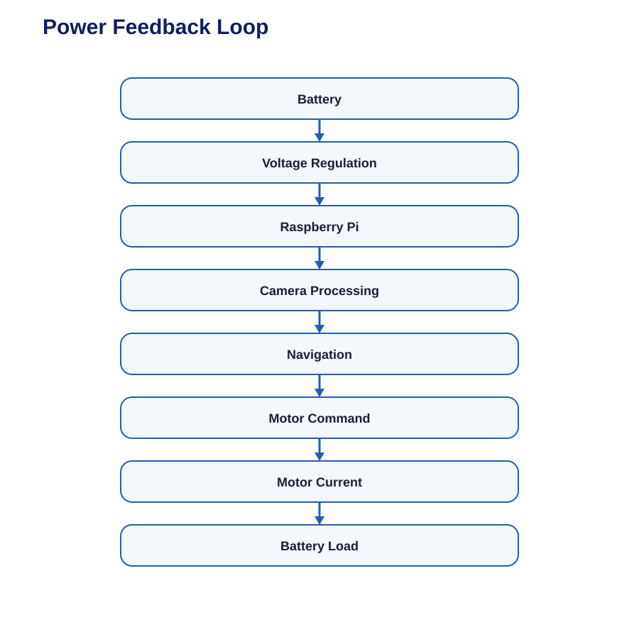

# Systems Thinking & Engineering Decisions

We treated the robot as one integrated system rather than as separate
mechanical, electrical, sensor, and software projects.

For example:

Similarly:

A change in one subsystem can therefore affect another subsystem.

This interaction was considered when making design decisions.

------------------------------------------------------------------------
