# BroCode

This repository contains the engineering documentation, software,
hardware design, testing process, and development history of our
autonomous robot for the **WRO Future Engineers 2026** category.

Our robot was developed with a focus on autonomous navigation, computer
vision, mechanical stability, controlled steering, obstacle management,
parking, reliability, and repeatable performance.

The purpose of this repository is not only to show the final robot, but
also to document **why** we made our major engineering decisions, what
alternatives we considered, what problems we encountered, how we tested
them, and how the design evolved.

Our development process follows:

**Design → Build → Test → Identify Problem → Analyse → Modify → Retest**

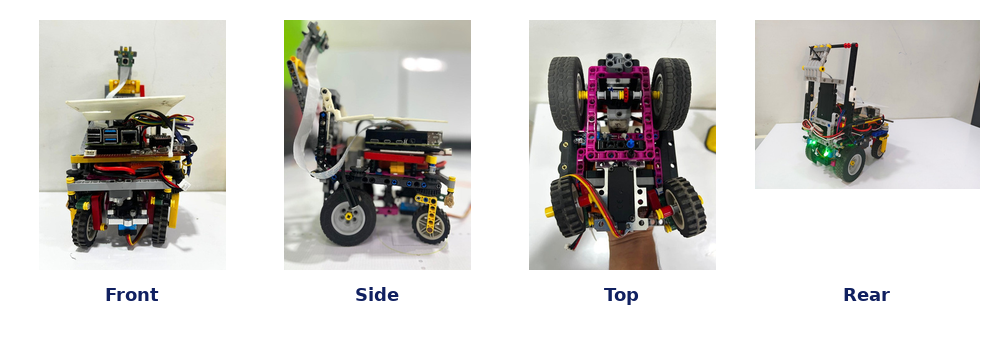

<table>
<tr>
<td align="center">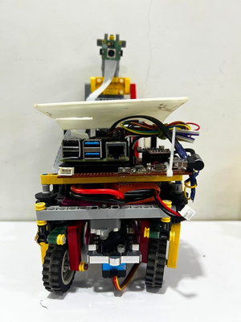 Front view</td>
<td align="center">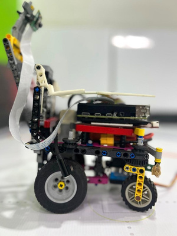 Side view</td>
<td align="center">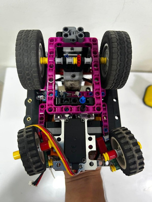 Top view</td>
<td align="center"> Rear view</td>
</tr>
</table>

------------------------------------------------------------------------

# Table of Contents

## 1. Project & Team

- [Team](#team)
- [Project Overview](#project-overview)
- [Engineering Objectives](#engineering-objectives)
- [Overall Robot Architecture](#overall-robot-architecture)

## 2. Mobility & Mechanical Design

- [Mobility & Mechanical Design](#mobility--mechanical-design)
- [Mobility and Drive System](#mobility-and-drive-system)
- [Steering System](#steering-system)
- [Mechanical Design Decisions](#mechanical-design-decisions)
- [Why We Chose LEGO](#why-we-chose-lego)
- [Mechanical Testing](#mechanical-testing)

## 3. Power & Sensor Architecture

- [Power & Sensor Architecture](#power--sensor-architecture)
- [Power Budget and Distribution](#power-budget-and-distribution)
- [Sensor Architecture](#sensor-architecture)
- [Sensor Selection and Trade-offs](#sensor-selection-and-trade-offs)
- [Sensor Placement](#sensor-placement)
- [Camera Calibration](#camera-calibration)
- [IMU Calibration](#imu-calibration)
- [Sensor Testing and Reliability](#sensor-testing-and-reliability)

## 4. Software Architecture & Obstacle Strategy

- [Software Architecture & Obstacle Strategy](#software-architecture--obstacle-strategy)
- [Software Modules](#software-modules)
- [Master State Machine](#master-state-machine)
- [Computer Vision](#computer-vision)
- [Colour Detection](#colour-detection)
- [Wall and Lane Following](#wall-and-lane-following)
- [Steering and Speed Control](#steering-and-speed-control)
- [Lap Counting and Debouncing](#lap-counting-and-debouncing)
- [Obstacle Detection and Strategy](#obstacle-detection-and-strategy)
- [Red / Green Obstacle Recognition](#red--green-obstacle-recognition)
- [Obstacle-Side Decision Logic](#obstacle-side-decision-logic)
- [Obstacle Avoidance and Recovery](#obstacle-avoidance-and-recovery)
- [Open Challenge Strategy](#open-challenge-strategy)
- [Parking Strategy](#parking-strategy)
- [IMU-Based Parking Alignment](#imu-based-parking-alignment)
- [Edge Cases and Failure Handling](#edge-cases-and-failure-handling)

## 5. Testing, Systems Thinking & Engineering Decisions

- [Testing, Validation & Tuning](#testing-validation--tuning)
- [Testing Methodology](#testing-methodology)
- [Testing Metrics](#testing-metrics)
- [Colour Threshold Testing](#colour-threshold-testing)
- [Steering Parameter Tuning](#steering-parameter-tuning)
- [Obstacle Detection Testing](#obstacle-detection-testing)
- [Lap Counting Testing](#lap-counting-testing)
- [Parking Testing](#parking-testing)
- [Software Iterations](#software-iterations)
- [Systems Thinking & Engineering Decisions](#systems-thinking--engineering-decisions)
- [Engineering Constraints](#engineering-constraints)
- [Engineering Trade-offs](#engineering-trade-offs)
- [Design Evolution](#design-evolution)
- [Problems → Solutions → Results](#problems--solutions--results)
- [Risk and Failure Analysis](#risk-and-failure-analysis)
- [Risk Mitigation](#risk-mitigation)
- [Evidence-Based Engineering Decisions](#evidence-based-engineering-decisions)

## 6. Reproducibility & GitHub Quality

- [Final System Architecture](#final-system-architecture)
- [Final Hardware Specifications](#final-hardware-specifications)
- [Bill of Materials](#bill-of-materials)
- [Reproducibility & GitHub Quality](#reproducibility--github-quality)
- [Software Setup](#software-setup)
- [Version Control](#version-control)
- [Testing Workflow](#testing-workflow)
- [Final Performance Validation](#final-performance-validation)
- [Final Robot](#final-robot)
- [Engineering Philosophy](#engineering-philosophy)
- [Conclusion](#conclusion)

------------------------------------------------------------------------

# Team

## BroCode

### 1. Tanish Kothari --- Software

Primary responsibilities:

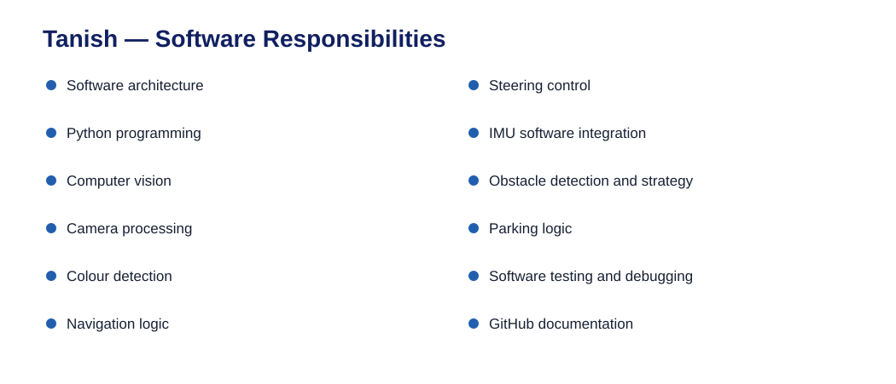

### 2. Vihaan Kothari --- Hardware

Primary responsibilities:

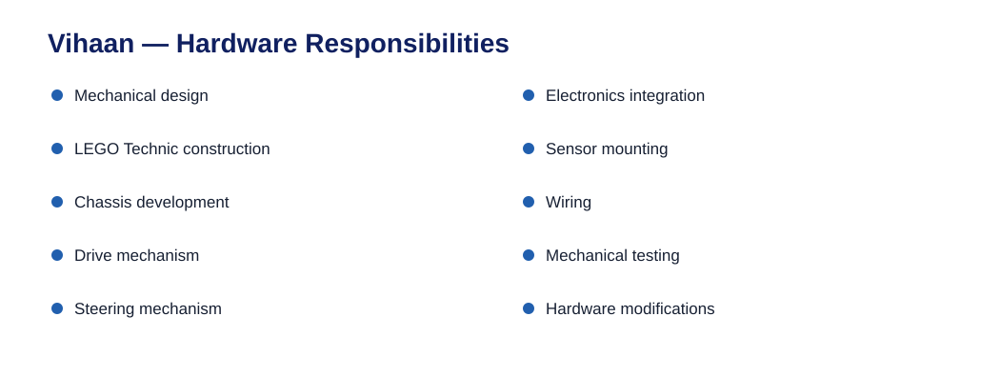

Both members contributed to the overall robot strategy, testing,
debugging, design decisions, system integration, and development of the
final robot.

------------------------------------------------------------------------

# Project Overview

The WRO Future Engineers challenge requires the robot to navigate the
track autonomously while responding to changing conditions.

The **Open Challenge** requires the robot to navigate changing internal
wall configurations. The **Obstacle Challenge** additionally requires
the robot to recognise red and green obstacles, obey the required side
of the track, and complete the parking task.

Because the environment is not completely fixed, our robot was designed
around closed-loop control rather than a sequence of pre-programmed
movements.

The robot continuously obtains information from its sensors, processes
that information, makes a navigation decision, and changes its movement
accordingly.

The overall control loop is:

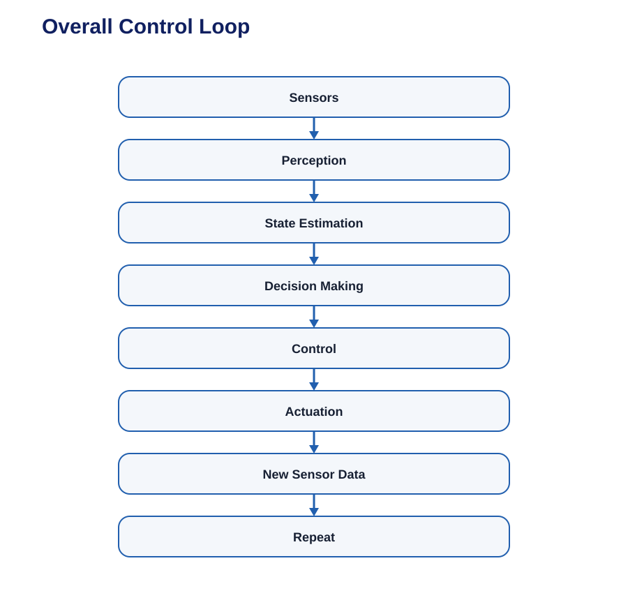

This allows the robot to respond to the actual state of the track
instead of replaying a predetermined route.

------------------------------------------------------------------------

# Engineering Objectives

Our main engineering objectives were:

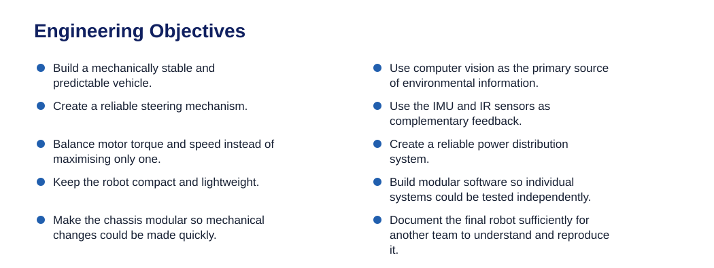

------------------------------------------------------------------------

# Overall Robot Architecture

The robot is divided into five closely connected subsystems:

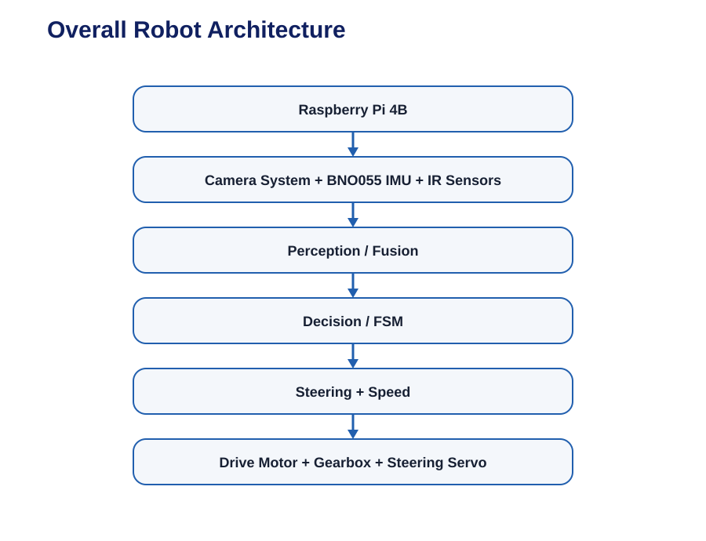

The systems are not independent. Camera position affects the field of
view available to the software, steering geometry affects the
relationship between a software command and vehicle movement, and motor
selection affects the speed and acceleration that the control system can
safely use.

This interaction between subsystems was considered throughout
development.

------------------------------------------------------------------------

# Mobility & Mechanical Design

The robot uses a hybrid structure made from **LEGO Technic components
and custom 3D-printed parts**.

The LEGO structure was selected because it allowed us to rapidly change
the chassis geometry during development. Components could be moved,
reinforced, or replaced without rebuilding the complete robot.

Custom 3D-printed components were used where standard LEGO geometry did
not provide the required solution. These included motor mounting and
housing components, camera mounting/protection, and other custom
structural parts.

The mechanical design was based on three requirements:

The approximate base footprint is **22 cm × 12 cm**. The camera is
mounted approximately **26 cm above the floor**, with its optical axis
angled approximately **10° downward from horizontal**.

The stated robot mass during development was approximately **800
g**.

------------------------------------------------------------------------

# Mobility and Drive System

The robot uses a **LEGO Medium Motor** for
propulsion.

The LEGO Medium Motor was important because it integrates directly 
with the LEGO Technic chassis while providing sufficient torque and 
speed for propulsion.

The basic relationship considered during motor selection was:

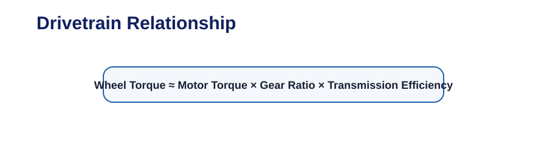

The motor provides a good balance between speed, torque, weight, and ease of integration.

Our objective was not to select the motor with the highest advertised
RPM or torque. We needed a combination that provided:

The LEGO Medium Motor provided the most suitable balance for
our robot.

------------------------------------------------------------------------

# Steering System

Steering is provided by the **RoboKits India UltraTorque Servo**, 
mounted securely on the front of the robot. The servo was selected
for its high torque and precise angular control, allowing the robot 
to make fast and accurate steering corrections.

Mechanical play wastreated as an important source of error. If the 
linkage or servo mounting moves under load, the same software 
command can produce different physical steering angles.

The steering loop is:

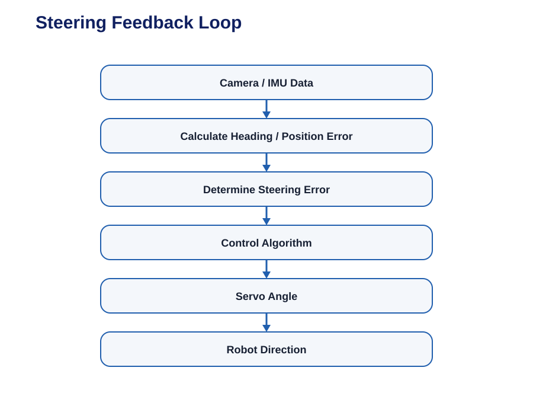

Mechanical geometry and software parameters were tuned together because
changing the steering geometry changes the relationship between servo
angle and vehicle motion.

------------------------------------------------------------------------

# Mechanical Design Decisions

## Motor Selection

We considered several motor options.

### N20 DC Motor

### REV NEO 550

### LEGO Medium Motor

### Final Choice: LEGO Medium Motor
The motor provides a good balance between speed, torque, weight, and ease of integration.

Our objective was not to select the motor with the highest advertised
RPM or torque. We needed a combination that provided:

The decision was based on the complete drivetrain requirement rather
than a single motor specification.

------------------------------------------------------------------------

# Why We Chose LEGO

The LEGO chassis was designed from scratch for our robot.

We selected LEGO because it provided:

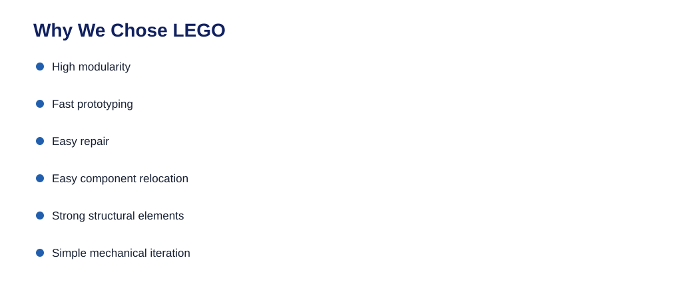

During development, being able to change the chassis quickly was more
valuable to us than using a completely fixed custom frame.

This allowed us to test different motor, camera, sensor, and structural
configurations without rebuilding the complete robot.

------------------------------------------------------------------------

# Mechanical Testing

Mechanical testing was performed after major changes to the drivetrain,
chassis, and steering system.

We evaluated:

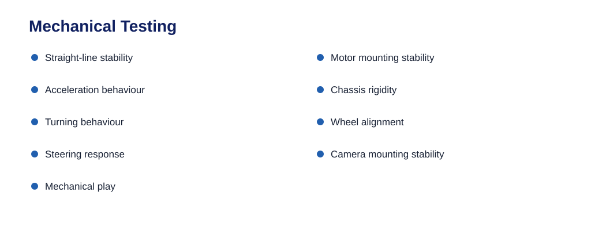

When inconsistent behaviour appeared, we first checked for a mechanical
cause before changing software parameters.

This prevented software tuning from being used to hide mechanical
instability.

------------------------------------------------------------------------

# Power & Sensor Architecture

<table><tr><td align="center">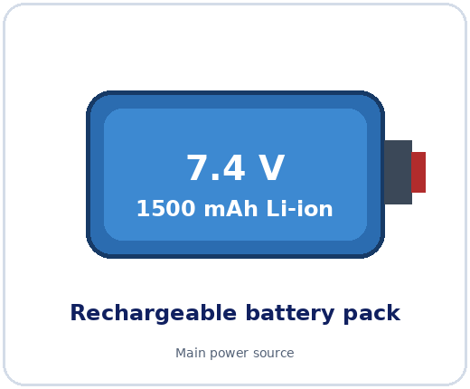 7.4 V rechargeable battery</td><td align="center">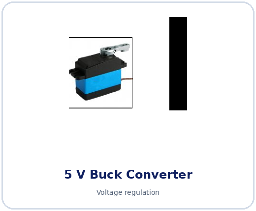 5 V buck converter</td><td align="center">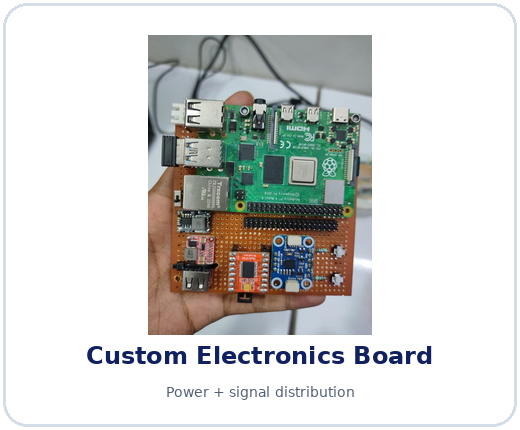 Custom electronics board</td></tr></table>

The robot uses a **7.4 V, 1500 mAh Li-ion rechargeable battery pack**.

The battery feeds the power distribution system, which provides the
appropriate supply to the motor system and regulated electronics.

The main architecture is:

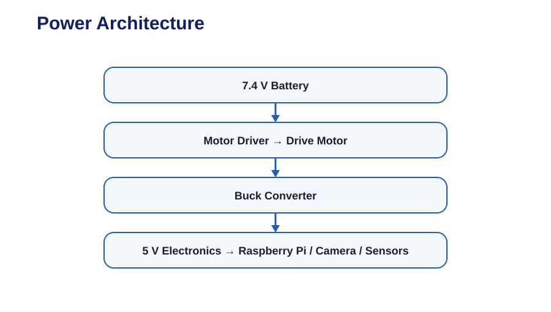

The Raspberry Pi requires a stable regulated supply because voltage
drops can cause instability or unexpected resets.

The motor power path and regulated electronics path were therefore
treated separately.

------------------------------------------------------------------------

# Power Budget and Distribution

The major electrical loads are:

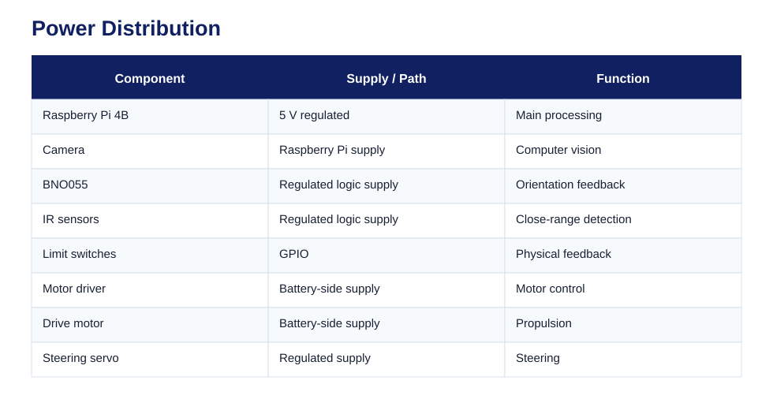

The main power risks identified were:

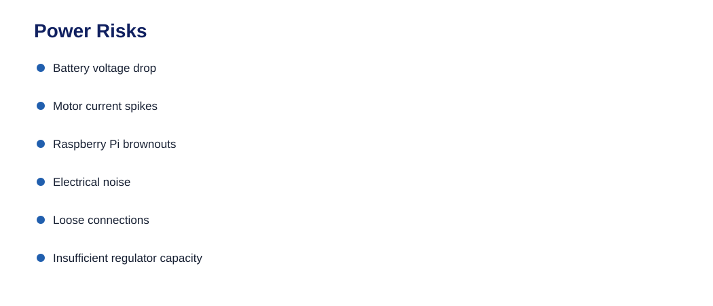

Power connections were secured, regulated supplies were used for
sensitive electronics, and the wiring was organised to reduce accidental
disconnections.

The power system was tested with the motor running because a power
system that is stable only when the motor is idle is not sufficient for
competition operation.

------------------------------------------------------------------------

# Sensor Architecture

<table><tr><td align="center">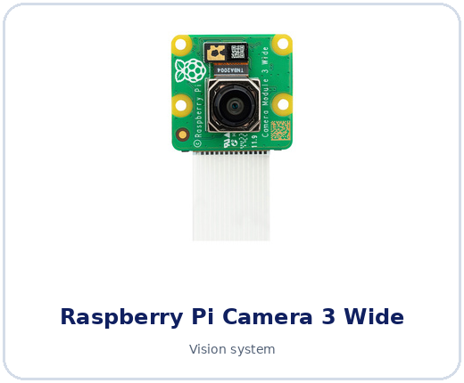 Raspberry Pi Camera Module 3 Wide</td><td align="center">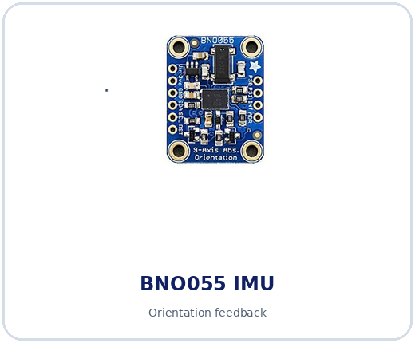 BNO055 IMU</td><td align="center">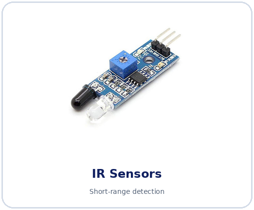 IR sensors</td><td align="center">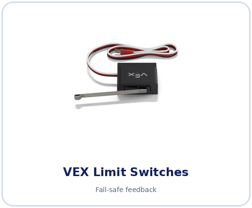 VEX limit switches</td></tr></table>

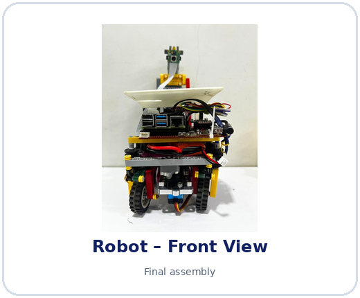

The robot uses multiple sensors because no single sensor provides
reliable information for every part of the challenge.

The main sensing systems are:

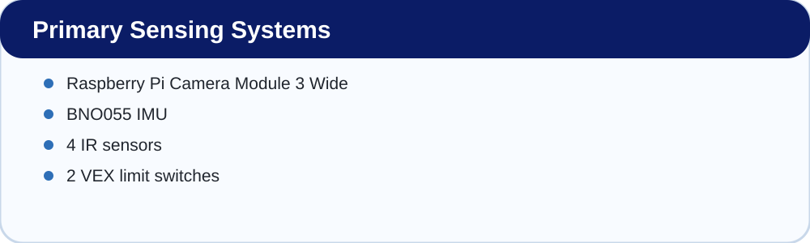

Each sensor has a defined role.

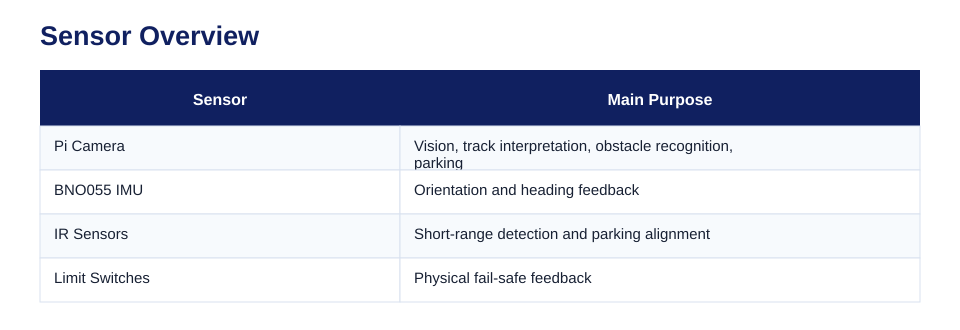

The camera is the primary perception sensor. The IMU provides
orientation information, while the IR sensors provide close-range
feedback where visual positioning becomes less reliable.

------------------------------------------------------------------------

# Sensor Selection and Trade-offs

## Camera

The camera provides substantially more environmental information than a
single distance sensor.

It can be used for:

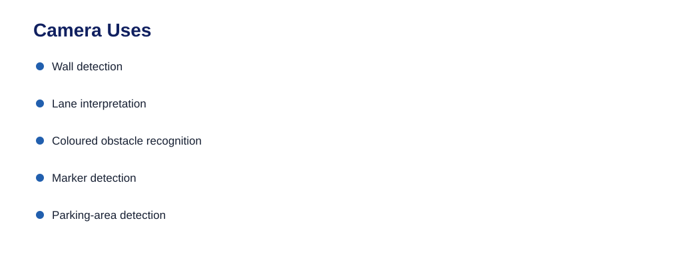

Its main limitation is sensitivity to lighting, exposure, and colour
thresholds.

## BNO055 IMU

The BNO055 provides orientation information using internal sensor
fusion.

It is useful for:

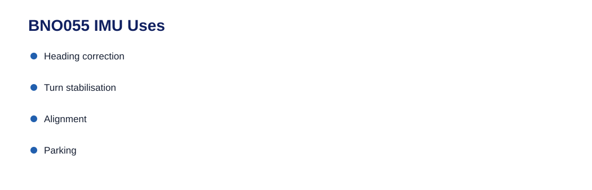

Its readings can still be affected by calibration and the robot's
mounting environment.

## IR Sensors

IR sensors are simple and fast for short-range detection.

They are particularly useful during parking when the robot is close to
the parking boundary.

Their limitation is that they provide much less environmental
information than the camera.

## Limit Switches

Limit switches provide simple physical feedback and an additional
fail-safe if the robot unexpectedly interacts with an object.

------------------------------------------------------------------------

# Sensor Placement

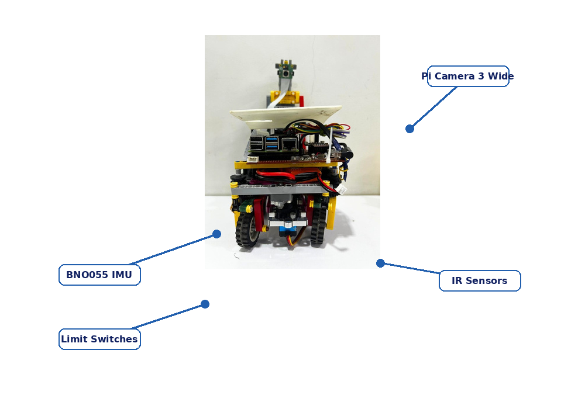

Sensor placement was based on the geometry of the task rather than
simply available space.

### Camera

The camera is:

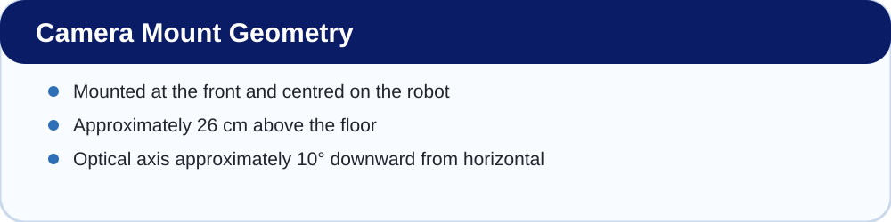

The centred mounting keeps the camera coordinate system aligned with the
robot's centreline.

The height and angle provide a forward field of view while allowing the
software to observe relevant track features before the robot reaches
them.

### BNO055

The BNO055 is mounted securely on the **left side of the robot**.

Its position is kept fixed so that the sensor's coordinate frame remains
consistent after calibration.

### IR Sensors

The IR sensors are placed toward the **rear of the robot** and are
primarily used for close-range parking detection and alignment.

### Limit Switches

The limit switches are positioned so that an unexpected physical
interaction can be detected.

------------------------------------------------------------------------

# Camera Calibration

Camera calibration and colour testing were performed using images
captured from the actual robot and track.

We initially tested RGB/BGR-based colour detection. We found that these
approaches were sensitive to changes in lighting and exposure.

We then tested HSV because it separates hue from brightness.

Finally, we tested LAB colour space and selected it for the
colour-detection approach that was most consistent during our testing.

The general processing pipeline is:

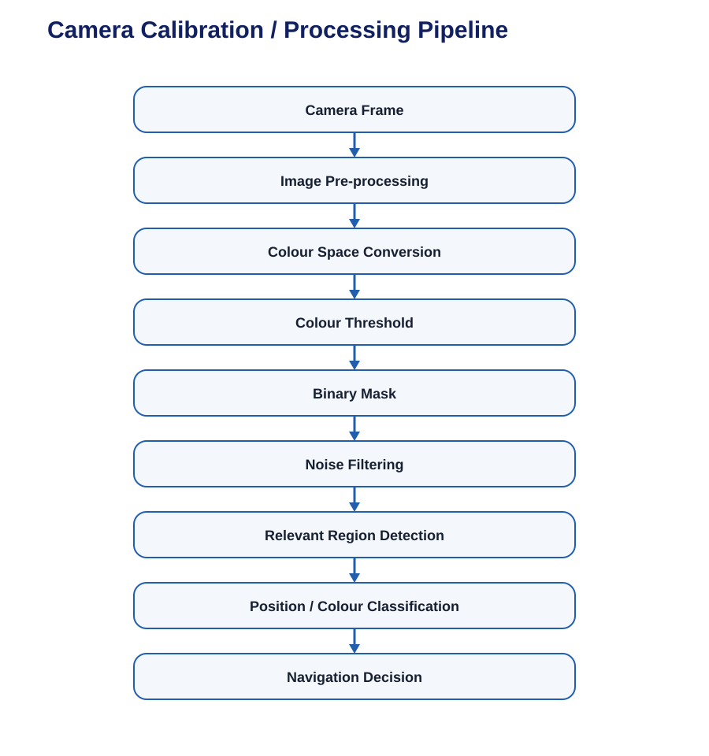

Thresholds were tuned using real camera data instead of relying only on
theoretical colour values.

This was one of the most important parts of our development because
camera reliability affects navigation, obstacle recognition, and
parking.

------------------------------------------------------------------------

# IMU Calibration

The BNO055 is calibrated before navigation testing.

The robot is kept stationary during the initial calibration process so
that a stable reference can be established.

The IMU is then tested by rotating the robot manually and checking
whether the reported heading changes consistently with the physical
movement.

Calibration is important because incorrect orientation information can
cause the robot to steer in the wrong direction or over-correct during
turns.

The IMU is therefore used as a feedback source and is not treated as a
replacement for visual information.

------------------------------------------------------------------------

# Sensor Testing and Reliability

Sensor testing was performed independently before full-system testing.

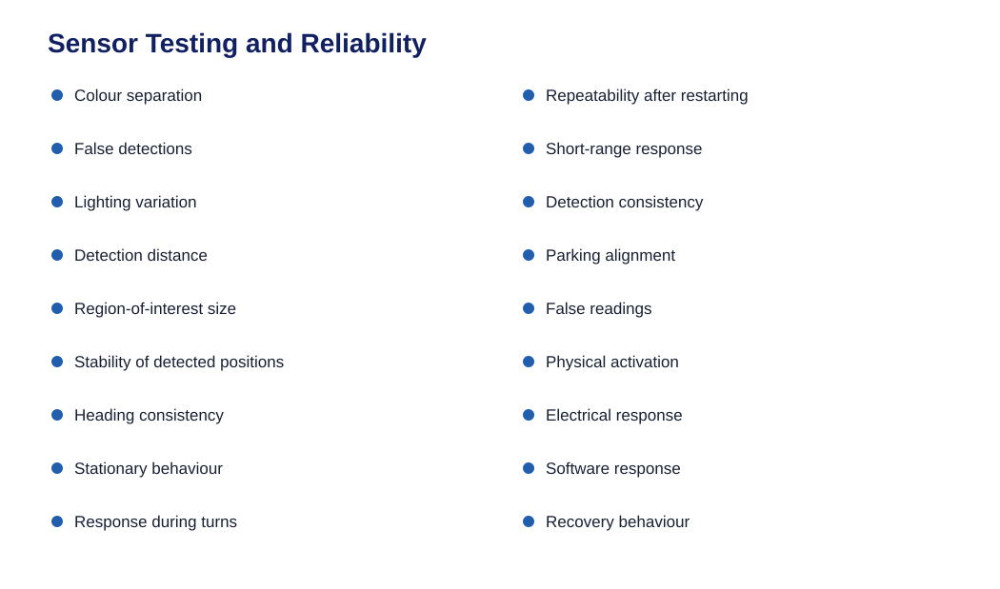

Testing sensors independently allowed us to determine whether a failure
originated from sensing, software, or the physical system.

------------------------------------------------------------------------

# Software Architecture & Obstacle Strategy

The robot software is modular rather than being one large program.

The main software layers are:

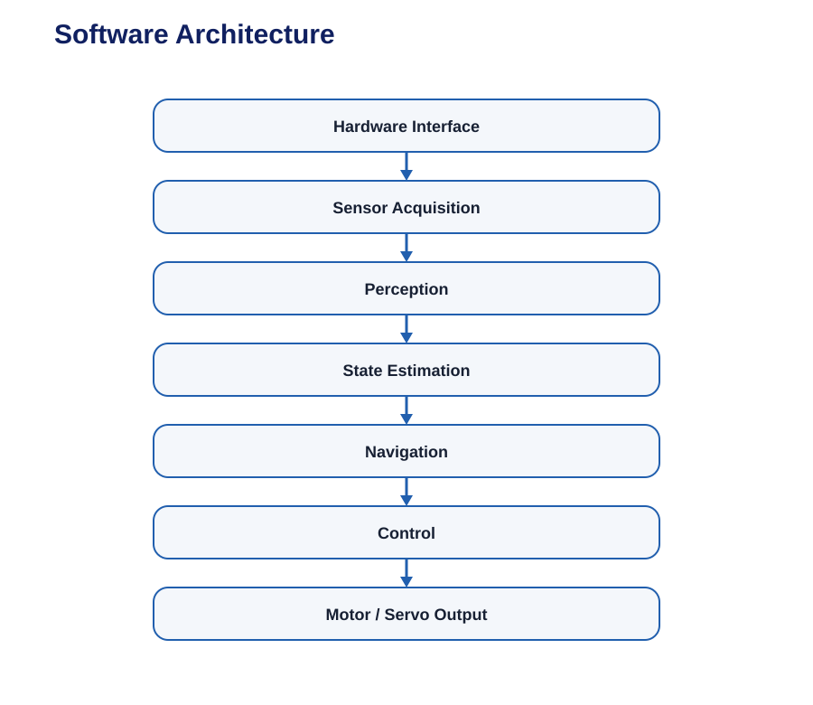

The main functional modules are:

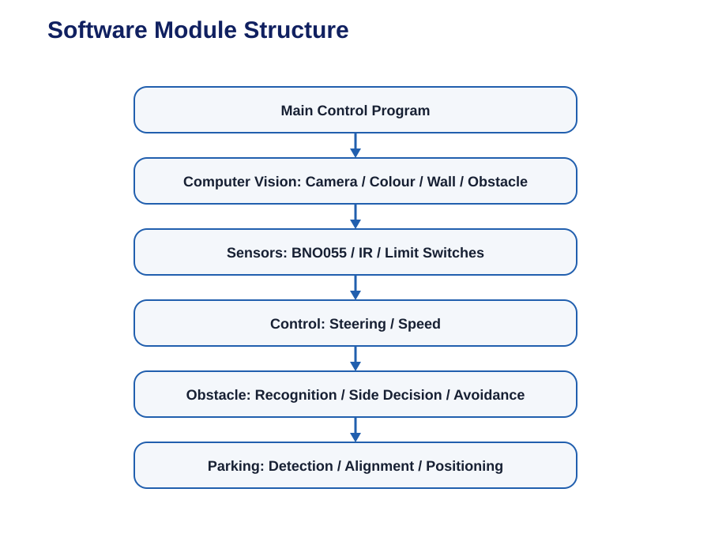

This structure makes it possible to test and modify individual systems
without rewriting the complete program.

------------------------------------------------------------------------

# Software Modules

The intended software organisation is:

Each module has a defined responsibility, making debugging and future
changes easier.

------------------------------------------------------------------------

# Master State Machine

The master state machine provides the overall structure of the robot's
behaviour.

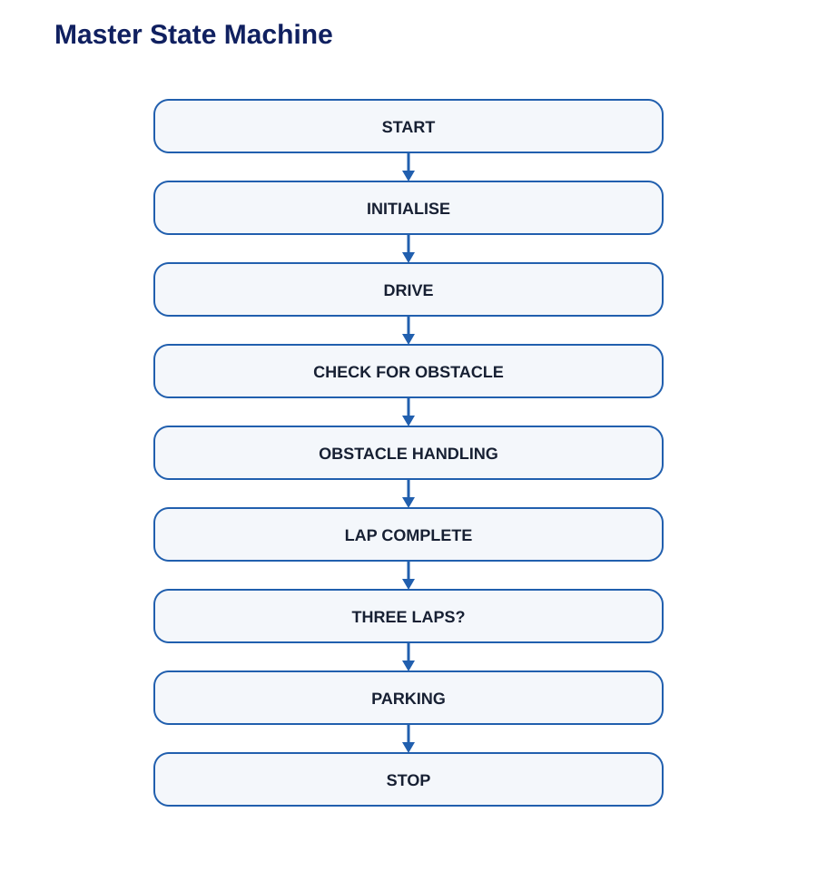

The state machine prevents unrelated behaviours from interfering with
one another.

For example, parking logic should not activate while the robot is still
completing its laps.

------------------------------------------------------------------------

# Computer Vision

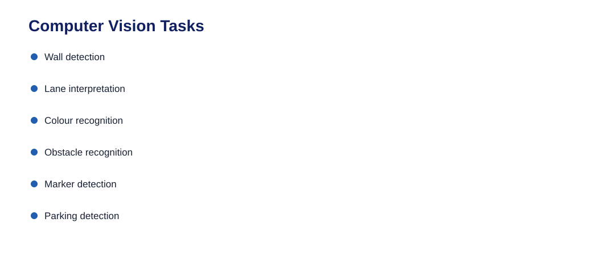

Computer vision is one of the main parts of our robot.

The Raspberry Pi Camera Module 3 Wide provides the visual input and
OpenCV is used to process the images.

The main vision tasks are:

Regions of interest are used where appropriate to reduce unnecessary
processing and focus the algorithm on areas relevant to navigation.

------------------------------------------------------------------------

# Colour Detection

We tested multiple colour representations during development.

RGB/BGR thresholding was investigated first, but colour classification
became inconsistent under changes in lighting and exposure.

HSV was then tested because it separates hue from brightness.

LAB was ultimately selected for the colour-detection approach that gave
the most consistent results during our testing.

The process is:

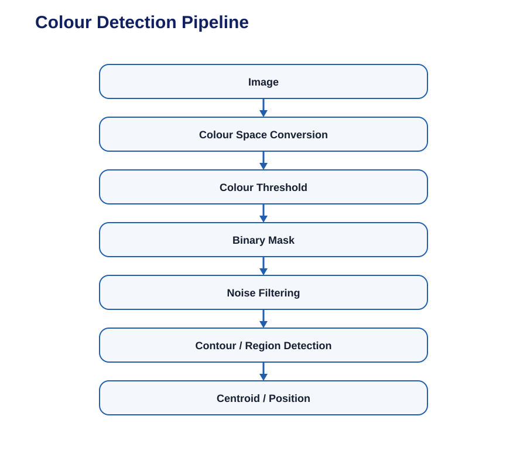

The detected colour region is then converted into information that can
be used by the navigation system.

------------------------------------------------------------------------

# Wall and Lane Following

The robot continuously estimates the position of relevant track
boundaries using the camera.

A target position is generated from the detected wall or lane geometry.

The difference between the target position and the detected position
becomes the steering error.

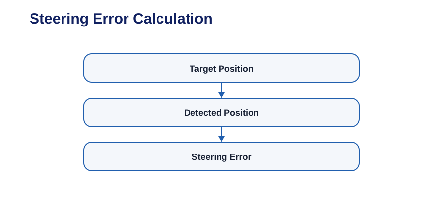

The controller converts this error into a steering command.

This allows the robot to continuously correct its path rather than
relying on fixed steering angles.

------------------------------------------------------------------------

# Steering and Speed Control

The steering system uses feedback.

If the robot is far from the desired path, the controller increases the
steering correction.

If the robot is close to the desired path, the correction becomes
smaller.

The basic proportional relationship is:

A proportional controller was selected because our primary requirement
was fast, predictable correction.

Too little correction caused drift, while too much correction caused
oscillation.

Steering parameters were therefore tuned experimentally.

Speed is also coordinated with steering. Higher speed can be used when
the robot is stable and the path is clear, while sharp turns or
uncertain perception can justify reducing speed.

The objective is not maximum motor speed; it is the highest speed that
remains reliably controllable.

------------------------------------------------------------------------

# Lap Counting and Debouncing

Lap counting is handled in software using visual markers and a debounce
condition.

Without debouncing, the same marker could be detected in multiple
consecutive camera frames and incorrectly increase the lap count several
times.

The logic is:

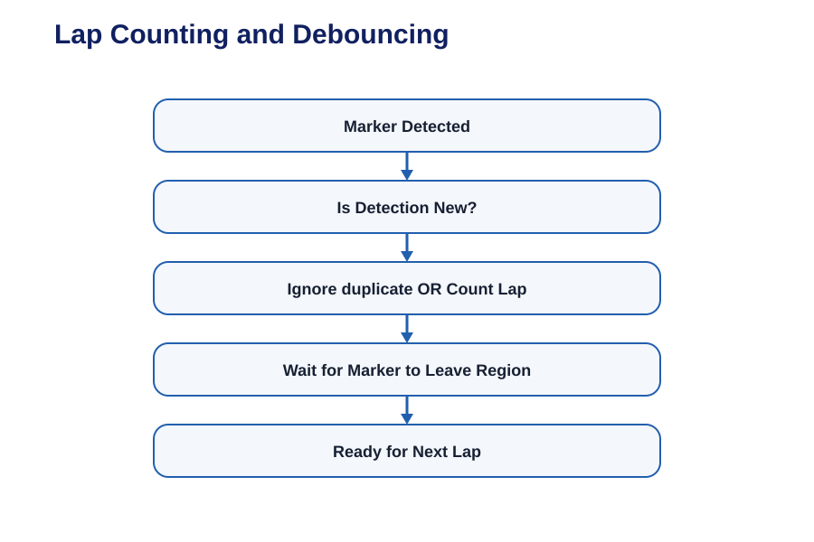

This prevents a single physical marker from producing multiple lap
counts.

------------------------------------------------------------------------

# Obstacle Detection and Strategy

In the Obstacle Challenge, the robot identifies coloured obstacles using
computer vision.

The two relevant colours represent different side-obedience
requirements.

The obstacle pipeline is:

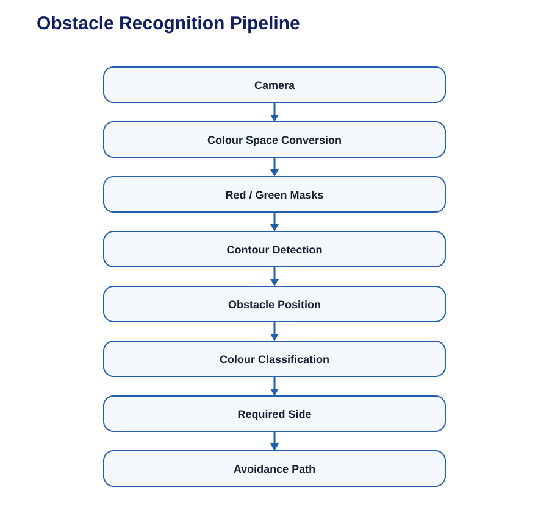

The robot uses the detected obstacle colour as an input to the
navigation decision rather than treating colour detection as an isolated
vision feature.

------------------------------------------------------------------------

# Red / Green Obstacle Recognition

The software uses separate colour masks to distinguish the two obstacle
colours.

The detected obstacle is classified according to its colour, and that
classification affects the required path.

The exact side decision is implemented in the obstacle strategy module
so that recognition and navigation remain separate software functions.

------------------------------------------------------------------------

# Obstacle-Side Decision Logic

The robot considers obstacle colour together with the current driving
state and visible track geometry.

The decision process is:

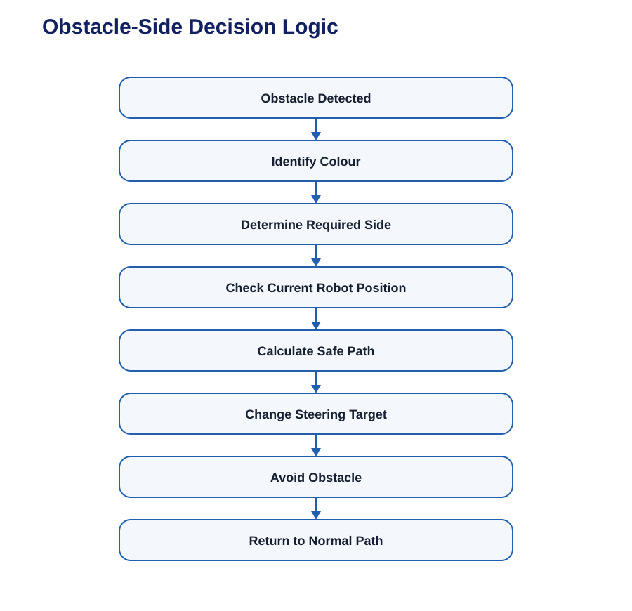

This allows the robot to respond to obstacle position rather than
relying on fixed obstacle coordinates.

------------------------------------------------------------------------

# Obstacle Avoidance and Recovery

Obstacle avoidance is divided into three stages.

### 1. Approach

The robot detects the obstacle and prepares for the required path
change.

### 2. Pass

The robot moves around the obstacle while maintaining clearance.

### 3. Recover

After passing the obstacle, the robot gradually returns toward the
normal path.

Gradual recovery is important because an immediate large steering
correction can cause oscillation or overshoot.

If the obstacle temporarily disappears from the camera after being
detected, the robot retains the current avoidance state for a short
period rather than immediately returning to normal navigation.

This prevents one missed frame from producing an incorrect path change.

------------------------------------------------------------------------

# Open Challenge Strategy

The Open Challenge can contain different internal wall configurations.

Our robot therefore does not depend on fixed coordinates for wall
positions.

Instead, it continuously detects visible wall geometry and adjusts its
path.

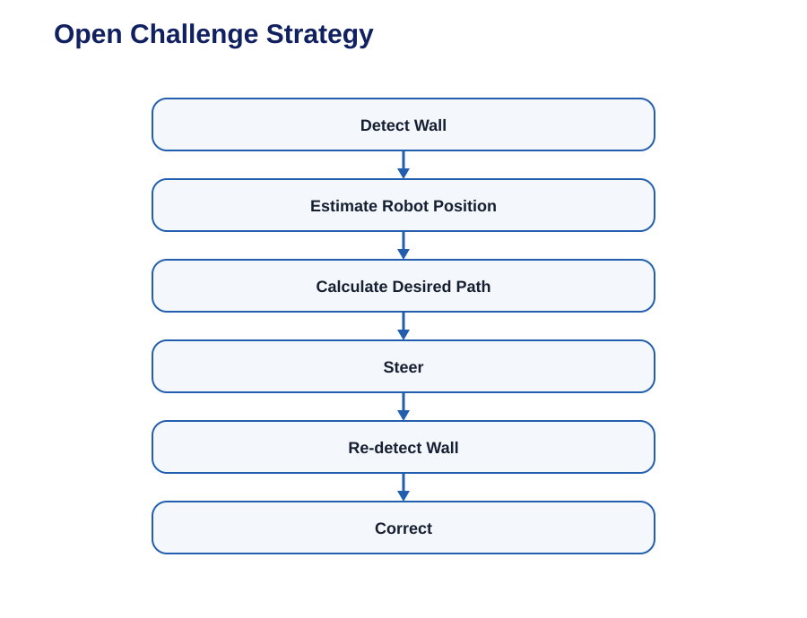

This allows the navigation system to adapt to different track layouts.

------------------------------------------------------------------------

# Parking Strategy

Parking was one of the most difficult parts of our design.

Our goal was to use the camera effectively while keeping the sensor
system as simple as possible.

The current parking development approach combines:

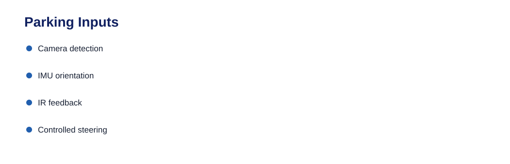

The intended sequence is:

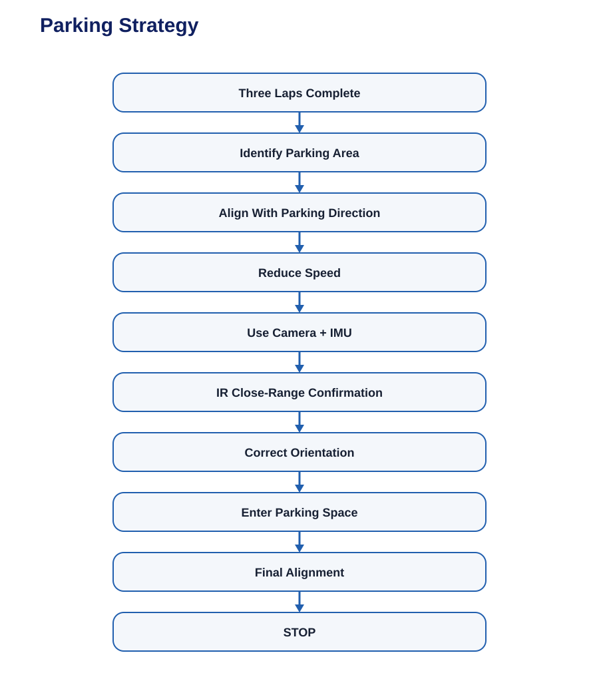

The camera provides the main environmental information while the IMU and
IR sensors provide additional feedback during the final alignment stage.

------------------------------------------------------------------------

# IMU-Based Parking Alignment

The BNO055 is used to estimate the robot's orientation during parking.

The robot compares its current heading with the desired parking
orientation.

The heading error is then used to determine whether an additional
steering correction is required.

This is useful because camera-only alignment can become less reliable
when the robot is very close to the parking boundaries.

The IMU therefore provides an independent orientation reference during
the final manoeuvre.

------------------------------------------------------------------------

# Edge Cases and Failure Handling

We considered situations where the normal navigation assumptions can
fail.

### Camera temporarily loses the wall

The robot retains the previous valid steering information and avoids
making an extreme correction from a single bad frame.

### False colour detection

Colour detections are filtered using thresholding and region checks
instead of accepting every coloured pixel.

### Multiple obstacle detections

The system evaluates relevant detected obstacle regions rather than
treating every coloured region as a separate obstacle.

### Sensor noise

Sensor readings are interpreted over time rather than relying on one
isolated measurement.

### Excessive steering

Steering output is limited so that one erroneous measurement cannot
produce an extreme command.

### Robot becomes misaligned

The recovery state reduces aggressive movement and attempts to return to
a stable visual path.

### Limit switch activation

A physical limit switch can provide an additional indication of
unexpected physical interaction.

------------------------------------------------------------------------

# Testing, Validation & Tuning

Testing was treated as an engineering process rather than a final
verification step.

Our development cycle was:

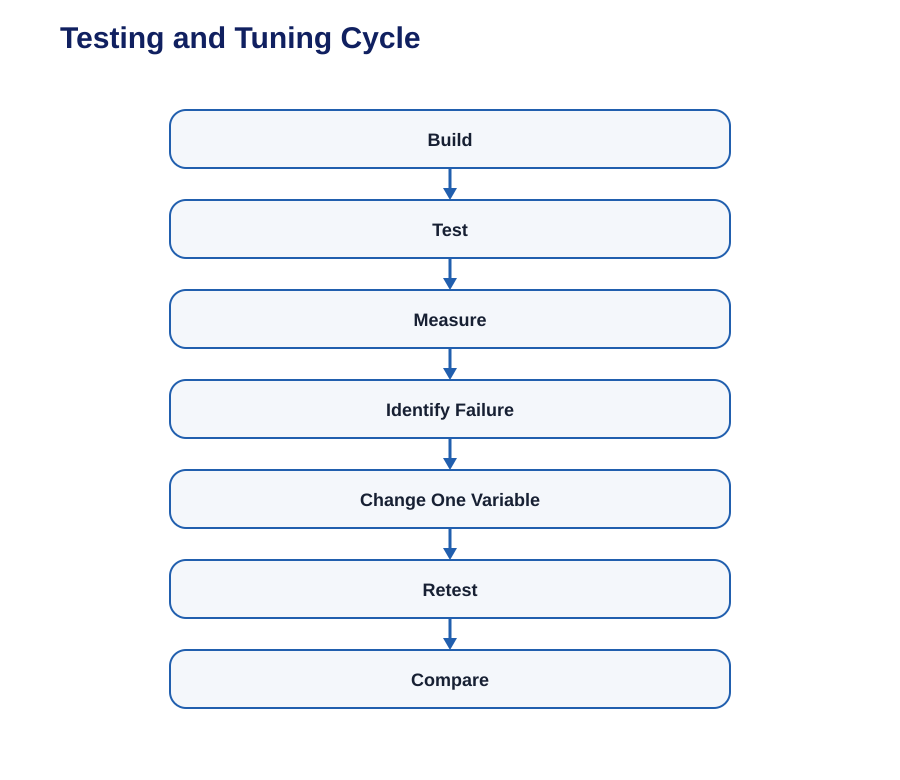

Changing one major variable at a time made it easier to determine
whether a change actually improved the robot.

------------------------------------------------------------------------

# Testing Methodology

Testing was divided into:

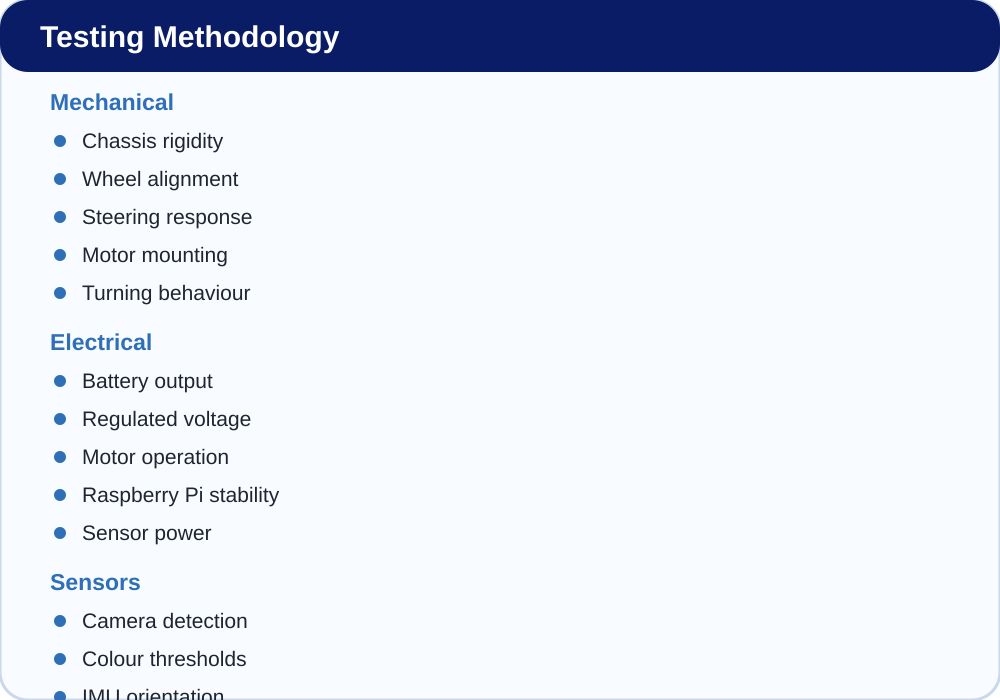

### Full-System Testing

The complete robot was tested with all systems operating simultaneously
because success of individual subsystems does not guarantee success of
the complete system.

------------------------------------------------------------------------

# Testing Metrics

We used measurable categories to evaluate changes rather than judging
improvements only by appearance.

The main performance metrics were:

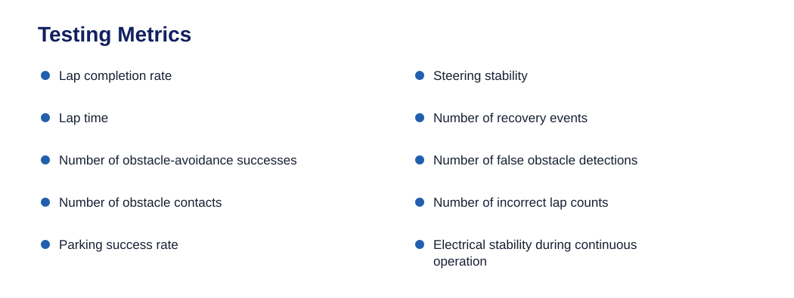

For software tuning, we looked particularly at the trade-off between:

A parameter was not considered better simply because it increased speed.
The objective was to improve speed while maintaining reliable
completion.

------------------------------------------------------------------------

# Colour Threshold Testing

Colour thresholds were tested using actual camera frames captured from
the robot.

The process was:

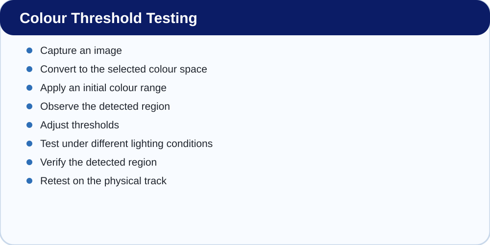

This reduced the chance that the robot would depend on one ideal
lighting condition.

------------------------------------------------------------------------

# Steering Parameter Tuning

Steering parameters were tuned through repeated driving tests.

The main failure modes were:

### Too little correction

The robot slowly drifted away from the desired path.

### Too much correction

The robot oscillated from side to side.

### Excessive steering at high speed

The robot could over-correct before the next useful camera update.

The final approach was therefore to balance steering gain with robot
speed.

------------------------------------------------------------------------

# Obstacle Detection Testing

Obstacle testing was performed by changing:

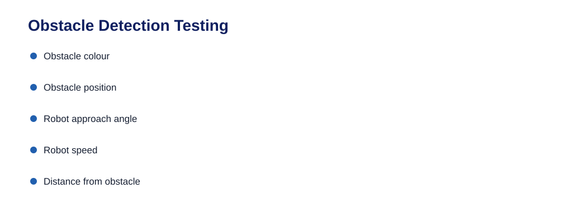

The objective was to verify that the software did not simply recognise
the colour but actually used it to make the correct navigation decision.

------------------------------------------------------------------------

# Lap Counting Testing

Lap counting was tested specifically for repeated detections.

A marker visible across several frames should still count as only one
lap event.

The debounce logic was therefore tested by:

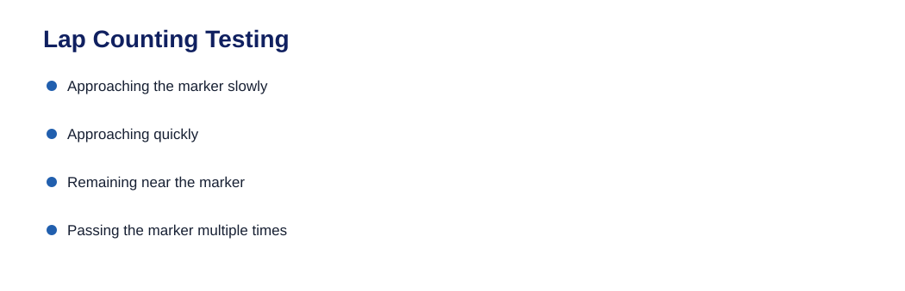

The final system accepts a new lap only after the previous detection has
cleared.

------------------------------------------------------------------------

# Parking Testing

Parking was tested separately from normal driving.

The main parameters considered were:

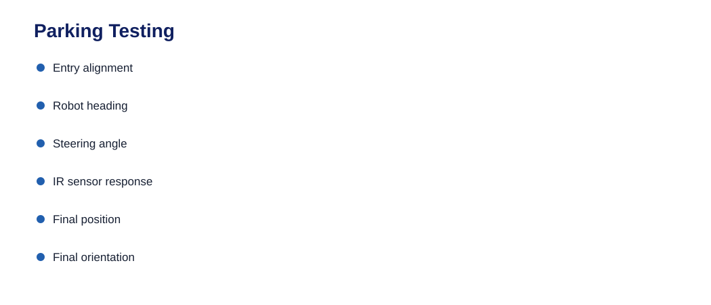

The parking algorithm was adjusted through repeated attempts rather than
relying on one successful run.

The objective was to determine which combination of camera information,
IMU heading, and IR feedback produced the most repeatable final
alignment.

------------------------------------------------------------------------

# Software Iterations

The software evolved through multiple iterations.

The important principle was that changes were made in response to
observed behaviour.

A simplified development sequence was:

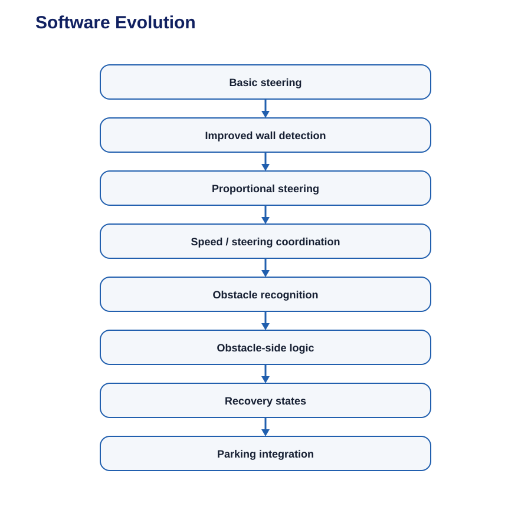

Each stage added functionality while preserving previously working
behaviour.

------------------------------------------------------------------------

# Systems Thinking & Engineering Decisions

We treated the robot as one integrated system rather than as separate
mechanical, electrical, sensor, and software projects.

For example:

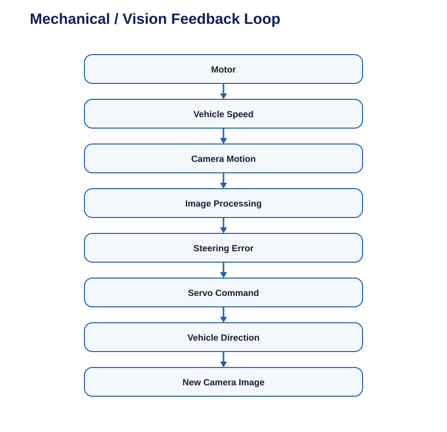

Similarly:

A change in one subsystem can therefore affect another subsystem.

This interaction was considered when making design decisions.

------------------------------------------------------------------------

# Engineering Constraints

The major constraints we worked under were:

Instead of optimising one subsystem independently, we looked for
solutions that worked within the complete system.

------------------------------------------------------------------------

# Engineering Trade-offs

## Speed vs Stability

A faster robot can produce a better lap time, but higher speed reduces
the time available for steering correction.

We therefore prioritised controllable speed over maximum possible speed.

## Torque vs Speed

A higher gear ratio provides more torque but reduces wheel speed.

We selected the 22:1 gearbox because the robot needed enough torque to
accelerate and maintain motion while still having useful speed.

## Camera Information vs Processing

A wider camera view provides more environmental information but also
increases the amount of image that must be processed.

The camera was positioned and processed using relevant regions of
interest to keep the system practical.

## LEGO Modularity vs Custom Construction

A fully custom chassis could provide more fixed geometry, but LEGO
allowed us to change the robot much faster during development.

We therefore used LEGO for the main structure and 3D printing where
custom geometry was necessary.

## Sensor Quantity vs Complexity

Adding more sensors can provide more redundancy, but it also increases
wiring, processing, and possible failure points.

We therefore gave each sensor a specific purpose rather than adding
sensors without a defined role.

------------------------------------------------------------------------

# Design Evolution

The robot was developed through repeated changes rather than as one
final design.

### Early Design

The initial objective was to create a vehicle capable of moving and
steering.

### Intermediate Design

Driving tests identified issues with:

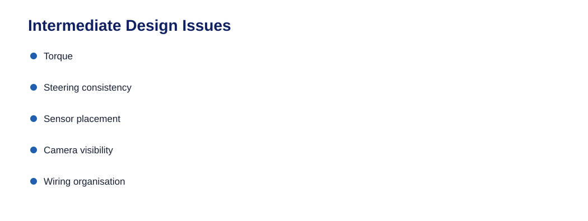

### Improved Design

We introduced:

### Final Design

The final system combines:

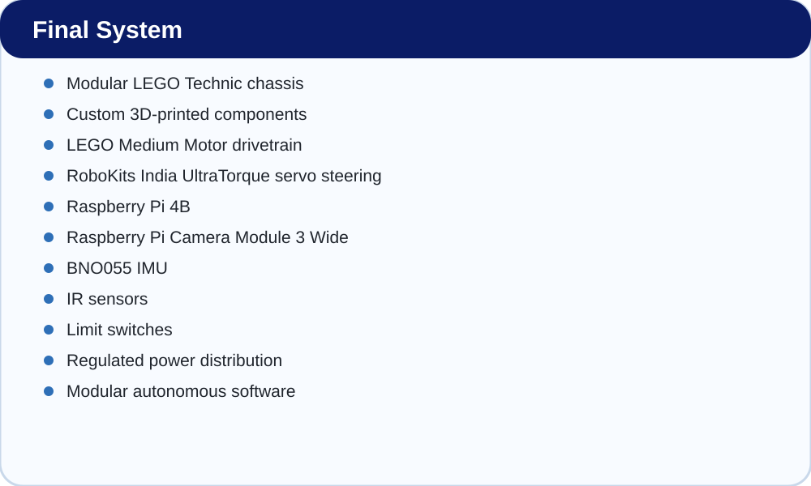

------------------------------------------------------------------------

# Problems → Solutions → Results

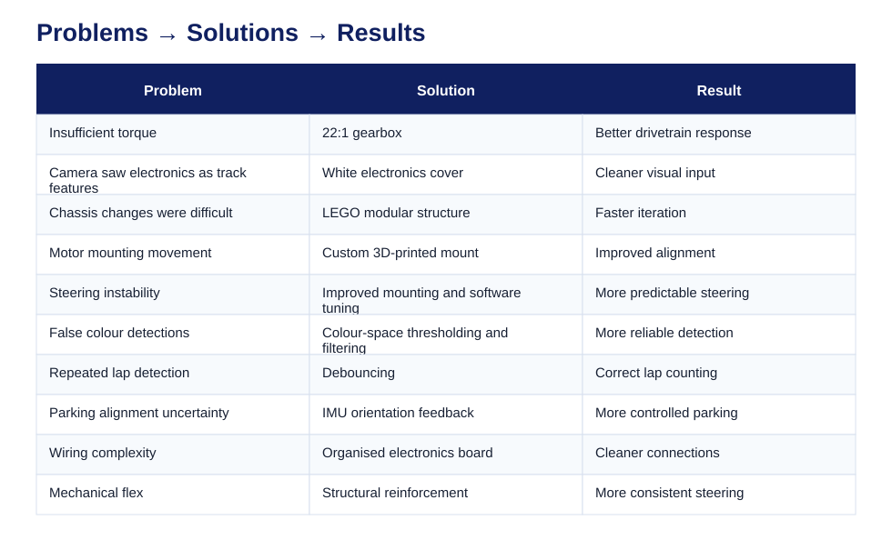

------------------------------------------------------------------------

# Why We Used a White Electronics Cover

During camera testing, the camera could sometimes see the colours and
components of the electronics.

This created false visual information.

The problem was particularly important because our software relies on
colour and object detection.

We therefore added a white cover over the electronics area.

The cover reduced unwanted visual features and made the camera view more
consistent.

This was an example of a mechanical change solving a software perception
problem.

------------------------------------------------------------------------

# Risk and Failure Analysis

We considered the following major failure modes:

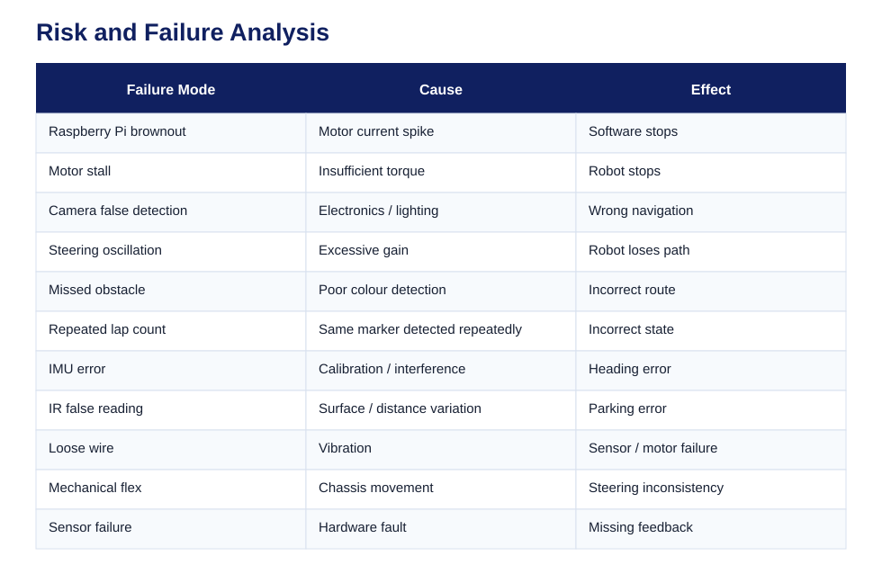

For example, camera failure cannot always be prevented, so the software
avoids making an extreme decision based on one bad frame.

Mechanical movement is reduced through stronger mounting, while software
tuning is performed only after the mechanical system is stable.

This prevents software parameters from being used to hide mechanical
problems.

------------------------------------------------------------------------

# Final System Architecture

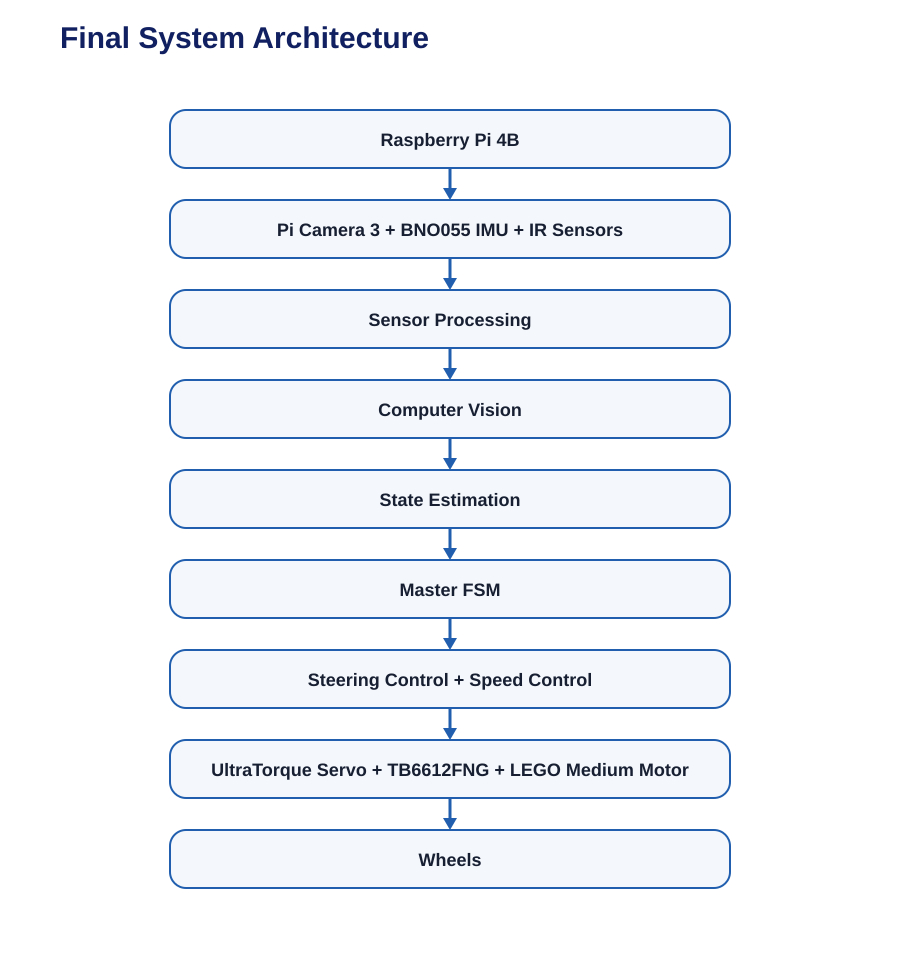

This architecture separates perception, decision-making, and actuation
while maintaining feedback between them.

------------------------------------------------------------------------

# Final Hardware Specifications

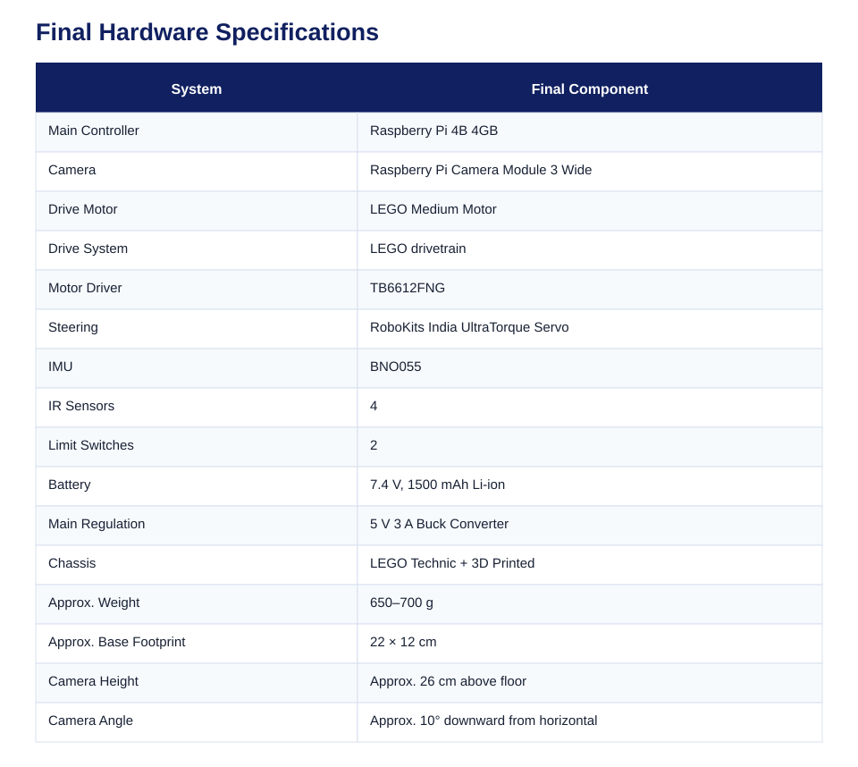

------------------------------------------------------------------------

## Bill of Materials------------------------------------------------------------------------

## Bill of Materials

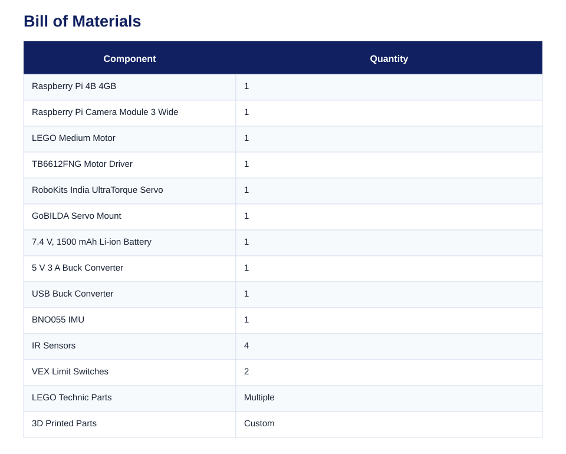

------------------------------------------------------------------------

# Reproducibility & GitHub Quality

# Reproducibility & GitHub Quality

A second team should be able to understand and reproduce the robot using
the documentation provided in this repository.

The documentation covers:

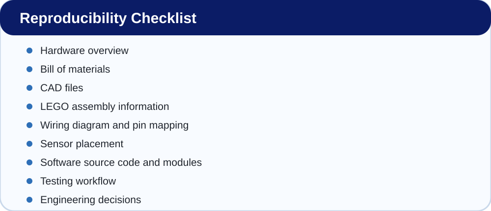

The mechanical documentation explains how the chassis and custom
components fit together.

The electrical documentation explains how the battery, regulators, motor
driver, controller, and sensors are connected.

The software documentation explains how those electrical components are
controlled by the program.

The exact GPIO and interface mapping should be maintained in the
dedicated wiring and pin-mapping documentation so that hardware changes
do not require rewriting the main README.

------------------------------------------------------------------------

# Software Setup

The software is intended to run on the Raspberry Pi.

The basic setup process is:

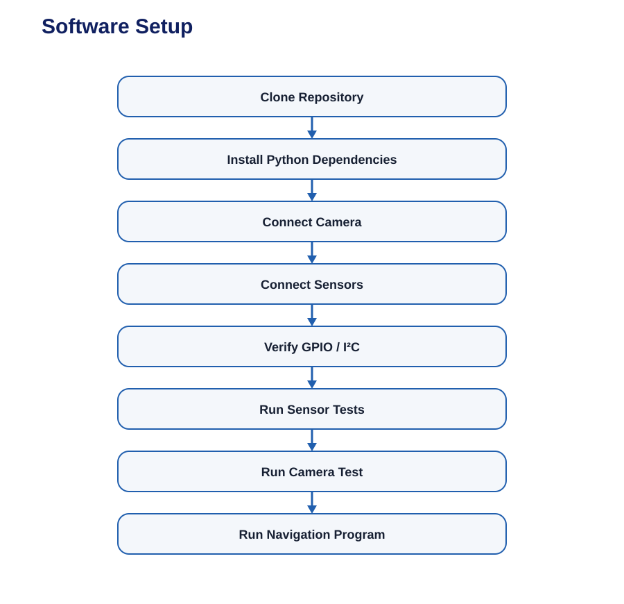

The software is divided into modules so that individual components can
be tested before running the complete autonomous program.

------------------------------------------------------------------------

# Version Control

GitHub is used as part of the engineering process rather than only as a
location for the final code.

Significant development changes should be recorded through meaningful
commits.

Examples of useful commit messages include:

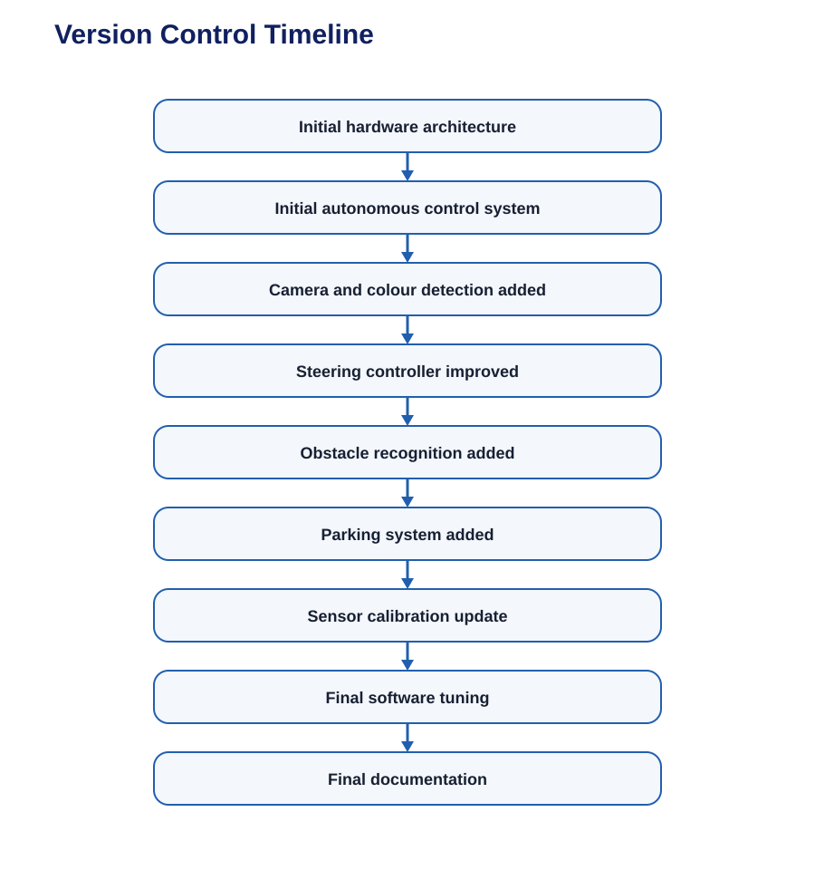

A useful commit should communicate what changed and, where relevant, why
it changed.

This allows the repository to show the engineering process instead of
only presenting a final code dump.

------------------------------------------------------------------------

# Testing Workflow

Our standard testing workflow is:

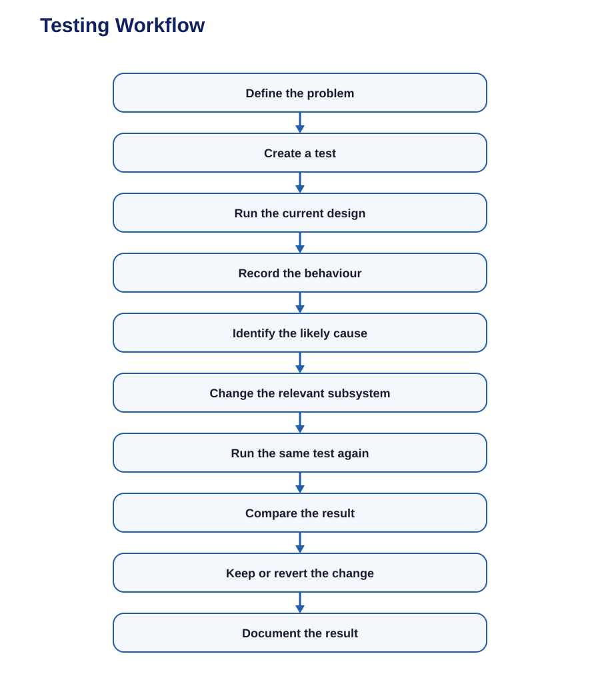

This prevents random tuning and makes engineering decisions traceable.

------------------------------------------------------------------------

# Evidence-Based Engineering Decisions

Important decisions were based on observed robot behaviour and testing.

### Motor

We selected the D360 + 22:1 gearbox because smaller alternatives did not
provide the required torque, while larger alternatives introduced
unnecessary size and complexity.

### Chassis

We selected LEGO because rapid modification and repair were important
during development.

### Camera

We selected the wide camera because the robot needs to observe the track
and obstacles ahead while driving.

### IMU

We selected the BNO055 because orientation feedback is useful for
steering stability and parking alignment.

### IR Sensors

We used IR sensors for close-range information where camera-based
positioning becomes less reliable.

### White Electronics Cover

We added the white cover after observing that the camera could
incorrectly interpret electronics as environmental features.

These decisions follow the engineering chain:

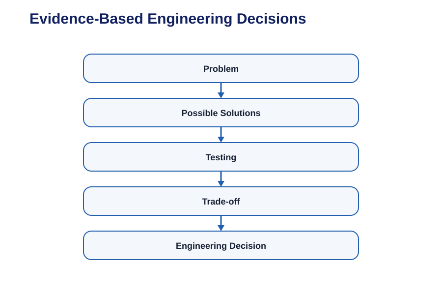

------------------------------------------------------------------------

# Final Performance Validation------------------------------------------------------------------------

# Final Performance Validation

**Current Open Challenge reference:** approximately **35 seconds per open-round lap**.

This is the main recorded performance figure currently available to us; other performance metrics are not presented as measured values unless they have been recorded.

The final robot is evaluated across the same major areas used during
development.

### Full System

The final test is performed with all subsystems operating simultaneously
because individual subsystem success does not guarantee full-system
success.

------------------------------------------------------------------------

# Final Robot

<table><tr><td align="center"> Front</td><td align="center">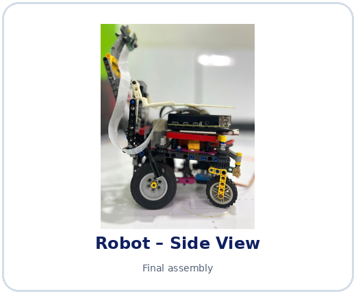 Side</td><td align="center">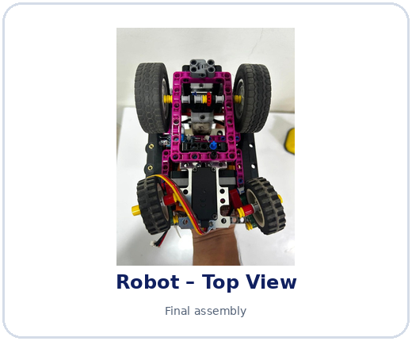 Top</td><td align="center">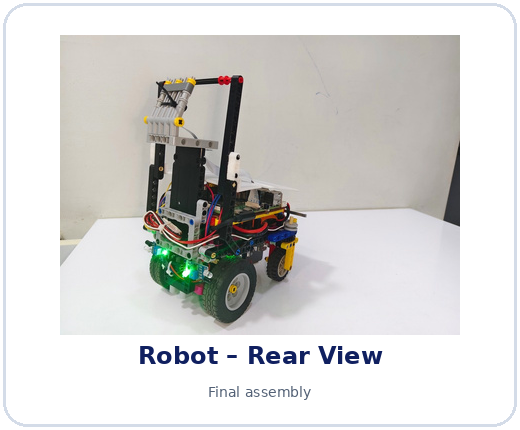 Rear</td></tr></table>

Our final robot is the result of repeated mechanical, electrical,
sensor, and software iterations.

The final design combines:

The most important feature of the design is the interaction between
these systems.

The camera provides information about the environment.

The IMU provides information about robot orientation.

The IR sensors provide close-range feedback.

The software combines these inputs to determine the robot's state.

The control system converts that state into steering and speed commands.

The mechanical system then produces the physical movement.

This creates a closed-loop autonomous vehicle.

------------------------------------------------------------------------

# Engineering Philosophy

The main lesson from developing this robot was that making a robot work
once is different from engineering a robot that works repeatedly.

Our development therefore focused on:

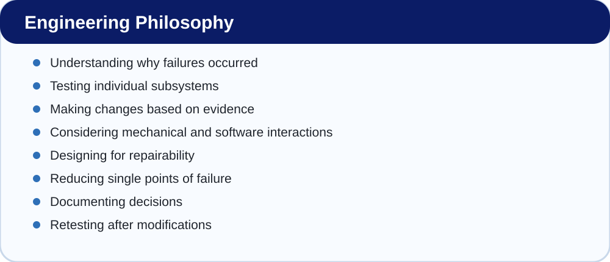

Whenever possible, we followed:

**Problem → Analysis → Solution → Test → Result**

rather than simply changing components until the robot appeared to work.

------------------------------------------------------------------------

------------------------------------------------------------------------

# Conclusion

BroCode's WRO Future Engineers robot was developed as an integrated
engineering system rather than as a collection of individual components.

The mechanical system provides the stability and movement required by
the software.

The electrical system provides controlled and reliable power.

The sensors provide information about both the environment and the
robot.

The software converts that information into decisions.

The control system converts those decisions into physical movement.

Testing connects all of these systems together and allows weaknesses to
be identified and corrected.

Our final design is the result of continuous iteration between
mechanical design, electronics, sensing, software, and control.

The purpose of this repository is to preserve that engineering process
and make the final robot understandable, reproducible, and useful to
anyone who wants to study or build upon the project.
