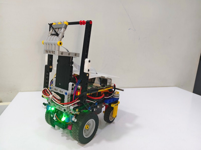

# BroCode

This repository contains the engineering documentation, software,
hardware design, testing process, and development history of our
autonomous robot for the **WRO Future Engineers 2026** category.

Our robot was developed with a focus on autonomous navigation, computer
vision, mechanical stability, controlled steering, obstacle management,
parking, reliability, and repeatable performance.

The purpose of this repository is not only to show the final robot, but
also to document **why** we made our major engineering decisions, what
alternatives we considered, what problems we encountered, how we tested
them, and how the design evolved.

Our development process follows:

**Design → Build → Test → Identify Problem → Analyse → Modify → Retest**


<table>
<tr>
<td align="center"><br><sub>Front view</sub></td>
<td align="center"><br><sub>Side view</sub></td>
<td align="center"><br><sub>Top view</sub></td>
<td align="center"><br><sub>Rear view</sub></td>
</tr>
</table>

------------------------------------------------------------------------

## Repository Structure

This repository is organised so that the engineering process can be explored from the highest-level overview down to individual mechanical, electrical, sensing, software, testing, and design-decision documents.

```text
BROCODE-WRO-FUTURE-ENGINEERS-2026/
```

## Table of Contents

- [01 — Team](01_TEAM/README.md)
- [02 — Robot](02_ROBOT/README.md)
- [03 — Electronics](03_ELECTRONICS/README.md)
- [04 — Sensors](04_SENSORS/README.md)
- [05 — Software](05_SOFTWARE/README.md)
- [06 — Obstacle Strategy](06_OBSTACLE_STRATEGY/README.md)
- [07 — Testing](07_TESTING/README.md)
- [08 — Design Iterations](08_DESIGN_ITERATIONS/README.md)
- [09 — Engineering Decisions](09_ENGINEERING_DECISIONS/README.md)
- [10 — Performance](10_PERFORMANCE/README.md)
- [11 — Documentation](11_DOCUMENTATION/README.md)
- [12 — Media](12_MEDIA/README.md)
- [13 — Releases](13_RELEASES/final/README.md)

## Final Robot


<table>
<tr>
<td align="center"><br><sub>Front view</sub></td>
<td align="center"><br><sub>Side view</sub></td>
<td align="center"><br><sub>Top view</sub></td>
<td align="center"><br><sub>Rear view</sub></td>
</tr>
</table>

## Engineering Documentation

The detailed engineering record is preserved in the numbered folders above. The repository keeps the original technical explanations while separating them into focused documents that are easier to navigate and reproduce.
